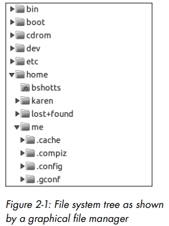

اولین چیزی که باید یاد بگیریم (جز نحوه تایپ کردن) این است که چگونه در سیستم فایل لینوکس حرکت کنیم. در این فصل، دستورات زیر را معرفی خواهیم کرد:

# درک ساختار درختی سیستم فایل

مانند ویندوز، سیستم‌عامل‌های شبه‌یونیکس مانند لینوکس، فایل‌های خود را در ساختاری سلسله‌مراتبی به نام ساختار دایرکتوری سازماندهی می‌کنند. این بدان معناست که فایل‌ها و دایرکتوری‌ها (که گاهی در سایر سیستم‌ها پوشه نامیده می‌شوند) در قالبی درختی مرتب شده‌اند.

اولین دایرکتوری در سیستم فایل، دایرکتوری ریشه (root directory) نام دارد. این دایرکتوری شامل فایل‌ها و زیردایرکتوری‌هایی است که خود می‌توانند حاوی فایل‌ها و دایرکتوری‌های بیشتری باشند و همین‌طور الی آخر.

توجه کنید که برخلاف ویندوز که برای هر دستگاه ذخیره‌سازی یک ساختار درختی مجزای سیستم فایل دارد، سیستم‌های شبه‌یونیکس مانند لینوکس همیشه یک ساختار درختی واحد برای سیستم فایل دارند، بدون توجه به اینکه چند درایو یا دستگاه ذخیره‌سازی به رایانه متصل شده باشد.
دستگاه‌های ذخیره‌سازی در نقاط مختلف این درخت اتصال (یا به عبارت دقیق‌تر، مانت) می‌شوند که این امر بستگی به تنظیمات مدیر سیستم (فرد یا افرادی که مسئول نگهداری سیستم هستند) دارد.

# دایرکتوری کاری فعلی

احتمالاً اکثر ما با مدیر فایل گرافیکی آشنا هستیم که ساختار درختی سیستم فایل را به شکلی مشابه شکل ۲-۱ نمایش می‌دهد.

توجه داشته باشید که این درخت معمولاً به صورت وارانه نمایش داده می‌شود، یعنی ریشه در بالا و شاخه‌های مختلف به سمت پایین گسترده شده‌اند.

اما در محیط خط فرمان، تصویری وجود ندارد. بنابراین برای پیمایش درخت سیستم فایل، باید آن را به شکل دیگری تصور کنیم.

تصور کنید سیستم فایل مانند یک هزارتو به شکل درختی وارونه است و ما می‌توانیم در وسط آن بایستیم. در هر لحظه، داخل یک دایرکتوری خاص قرار داریم که می‌توانیم:
فایل‌های موجود در آن دایرکتوری را ببینیم، 
مسیر به دایرکتوری بالاتر (که به آن دایرکتوری والد می‌گویند) را مشاهده کنیم، 
و زیردایرکتوری‌های پایین‌تر را ببینیم
به دایرکتوری که هم‌اکنون در آن قرار داریم، دایرکتوری کاری فعلی می‌گوییم. برای نمایش دایرکتوری کاری فعلی، از دستور pwd (مخفف print working directory) استفاده می‌کنیم.

هنگامی که برای اولین بار وارد سیستم می‌شویم (یا یک نشست ترمینال را آغاز می‌کنیم)، دایرکتوری کاری فعلی ما بر روی دایرکتوری خانگی تنظیم می‌شود. هر حساب کاربری دارای یک دایرکتوری خانگی اختصاصی است، و این تنها مکانی است که یک کاربر عادی اجازه دارد در آن فایل‌ها را بنویسد.
